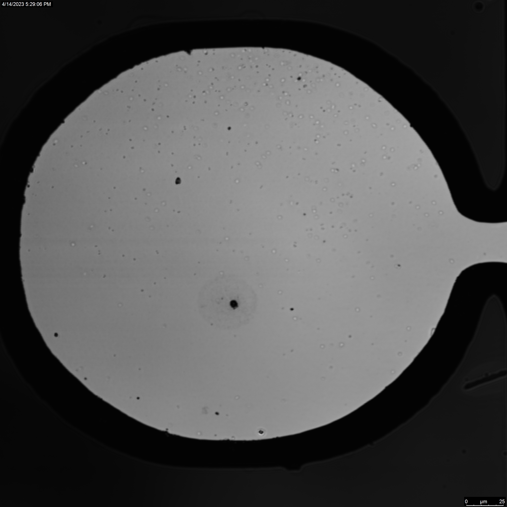
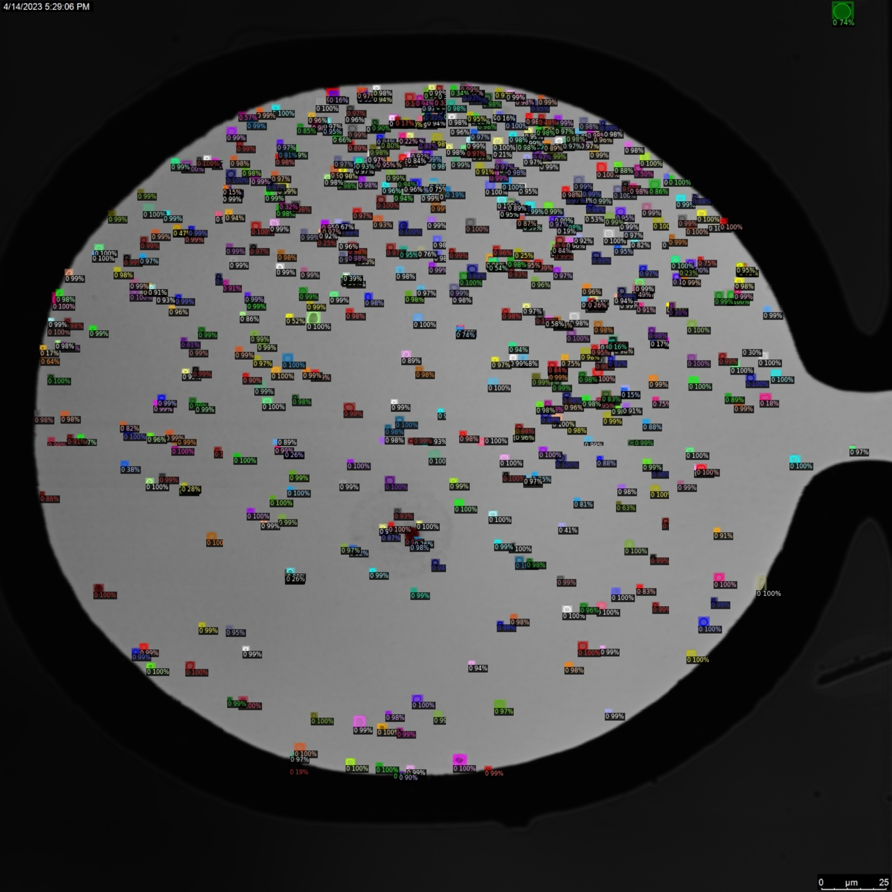
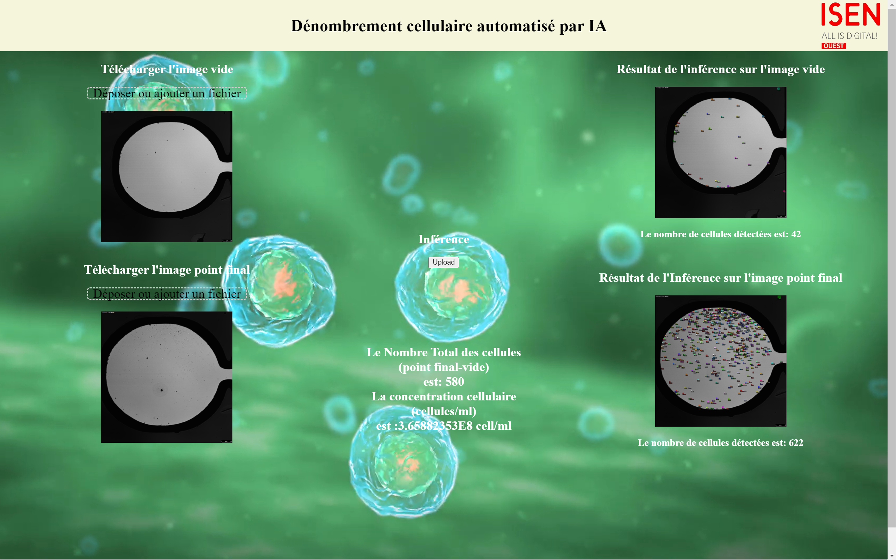

# Dénombrement cellulaire automatisé par IA

**CHÉHADÉ Karim**  
**OUEIDAT Mohamad**  
**CARIO Anaïs**  
**MOALIC Yann**  


Ce projet est réalisé en collaboration avec l'**Institut de Chimie de la Matière Condensée de Bordeaux**. Il vise à automatiser le comptage des cellules dans les images microscopiques acquises lors de suivis de croissances cellulaires dans des piscines microfluidiques. Pour ce faire, nous développons un système d’apprentissage automatique capable de :

- Traiter un grand volume de données.
- Identifier les cellules dans les images.
- Compter leur nombre.

## Méthodologie

Pour le traitement des images, nous utilisons **Detectron2**, un framework de pointe développé par Facebook AI pour l’analyse d'images et la vision par ordinateur. Detectron2 nous permet de tirer parti de modèles pré-entraînés et de construire des réseaux de neurones personnalisés pour répondre aux besoins de ce projet.


## Résultats

Nous avons obtenu les performances suivantes sur notre jeu de données de Test :

- **Précision** : 0.88  
- **Recall** : 0.86  
- **Temps d’entraînement (h)** : 4.25  

### Visualisation des résultats

#### Image originale
L’image ci-dessous montre un échantillon d’image microscopique avant traitement par notre modèle.



#### Image Annotée
Voici l'image annotée après avoir été traitée par notre modèle Detectron2 :



## Déploiement

Lorsque l’entraînement est terminé et qu’on dispose d’un modèle valide, il est temps de le déployer. Le déploiement d’un modèle peut se faire de multiples manières, en fonction de la façon dont les prédictions seront consommées en production.

Les étapes clés du déploiement incluent :

1. **Le packaging du modèle et de ses dépendances**.
2. **La transformation en API (Application Programming Interface)**.

De nombreux frameworks permettent de transformer un modèle en web-app, notamment **Flask**.

### Interface de Déploiement



### Citations

```bibtex
@misc{wu2019detectron2,
  author =       {Yuxin Wu and Alexander Kirillov and Francisco Massa and Wan-Yen Lo and Ross Girshick},
  title =        {Detectron2},
  howpublished = {\url{https://github.com/facebookresearch/detectron2}},
  year =         {2019}
}

